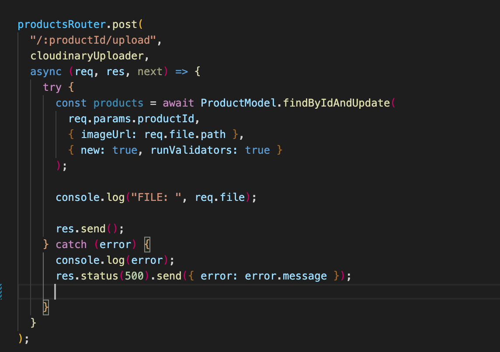
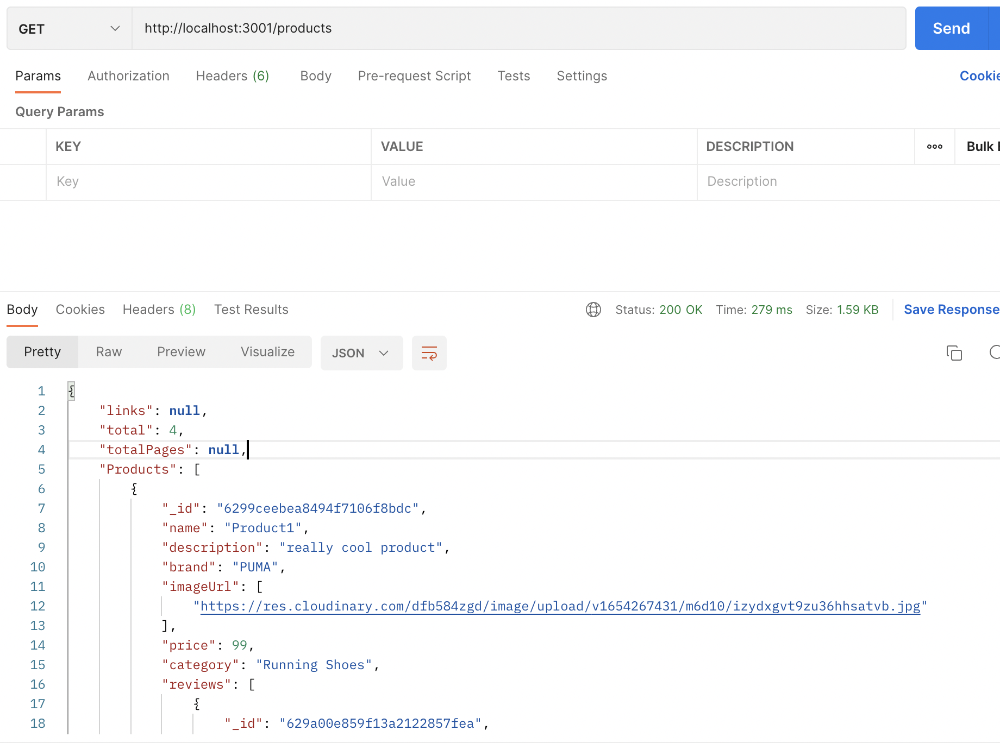

<h1>Backend build in Node / Express / MongoDB</h1>

This backend represents an eCom store backend. 

The backend was built using Node, Express.js and MongoDB. Router wise it includes a GET, POST, GET:byId, PUT and DELETE request. As well as a "review" section and a "Cart" section. 

One of the main features for this backend is the ability to upload a picture and send it to a cloudinary storage. 

<h2>Technologies used:</h2>

- Express

- Node

- NPM

- GIT

- MongoDB

- Cloudinary

<h2>Screenshots:</h2>

